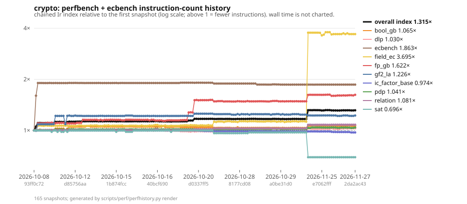
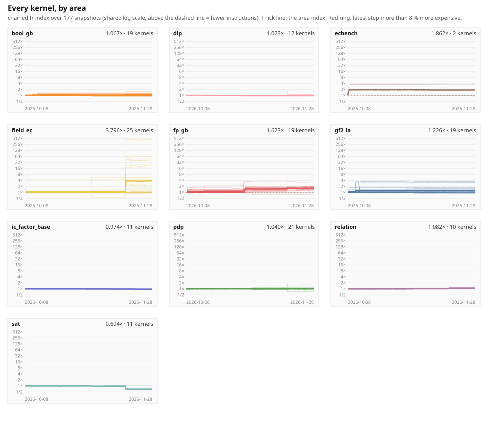

# Performance history

Generated by `scripts/perf/perfhistory.py render` from the snapshots in `docs/perf/history/`; do not edit by hand.  One snapshot per measured commit: callgrind instruction counts (`Ir`) of every quick `perfbench` kernel and of the frozen `ecbench` children in `docs/perf/ecbench-children.json`, with a wall-time reading beside each.  The index chains consecutive `Ir` ratios and takes no credit across a fingerprint change (the kernel computed something else: **re-based**).  Formula: `docs/perf/PERFORMANCE_INDEX.md`; what this does and does not mean: engineering class, `AGENTS.md` §3.  **Noise floor:** two builds of different sources move the `Ir` of untouched kernels by up to a few per cent (the release profile's 16 codegen units are partitioned afresh, and cross-module inlining changes with them), so a single step under about 5 % on one kernel is build noise, not a result; a trend over several snapshots, or an area index, is.



**Latest snapshot:** `a6223dac3a5e` (2026-11-24T09:43:24Z) — Merge pull request #5149 from isogeny-labs/claude/fix-main-ci-20261124  
**Snapshots:** 141, from `93ff0c72333c` (2026-10-08).  
**Overall chained Ir index since first snapshot:** **1.317×**  

> **12 kernel(s) got more than 8 % more expensive in the latest step:** `sat/xor_planted_n120_x6` +47.3 %, `sat/koblitz_bool_native_m3_n15_x3` +46.3 %, `sat/random3sat_n200_r426_x5` +45.1 %, `sat/semaev_s4_n15l5_unsat_x1` +44.7 %, `sat/koblitz_bool_native_m2_n19_x2` +44.4 %, `sat/random3sat_n150_r426_x12` +44.3 % …



## Factor bases

Frozen index-calculus solves (`ecbench exec`, area `ic_factor_base`, weight 0 so they never move the overall index) with the factor base each one built, its size and the symmetry it is closed under, next to the matched rho reference on the same curve. Symmetry classes follow `docs/ecbench/FACTOR_BASE_PROTOCOL.md`: a base folded by signed Frobenius or by the GLV automorphism needs fewer columns for the same coverage.


| curve | run | factor base | symmetry | columns | signed points | solve Ir | group ops | × rho Ir | index |
|---|---|---|---|---:|---:|---:|---:|---:|---:|
| Koblitz a = 1, n = 17 | `k17_rho_signed_frobenius` | rho | — | — | — | 787,714 | 137 | 1× | 0.941× |
| Koblitz a = 1, n = 17 | `k17_compact_orbit_scan` | `compact-orbit-scan:columns=8,raw_x_cap=5000` | signed Frobenius | 8 | 272 | 3,526,628 | 2,314 | 4.5× | 0.995× |
| Koblitz a = 1, n = 17 | `k17_binary_subspace` | `binary-subspace:dimension=4` | none | 5 | 10 | 5,680,697 | 5,488 | 7.2× | 0.996× |
| Koblitz a = 1, n = 17 | `k17_standard_subspace` | `koblitz-standard-subspace:dimension=4` | none | 6 | 11 | 5,751,435 | 5,499 | 7.3× | 0.996× |
| Koblitz a = 1, n = 17 | `k17_koblitz_orbit` | `koblitz-orbit:divisor=0;1` | signed Frobenius | 14 | 443 | 7,372,013 | 4,315 | 9.4× | 0.998× |
| prime, 20-bit, generic (automorphisms ±1) | `p20_rho_negation` | rho | — | — | — | 661,552 | 143 | 1× | 0.966× |
| prime, 20-bit, generic (automorphisms ±1) | `p20_prime_abscissa` | `prime-abscissa:size=32` | negation | 32 | 64 | 5,648,957 | 7,171 | 8.5× | 0.996× |
| prime, 20-bit, generic (automorphisms ±1) | `p20_glv_orbit_generic` | `glv-orbit:size=16` | negation | 16 | 32 | 6,017,056 | 7,190 | 9.1× | 0.996× |
| prime, j = 0: y² = x³ + 15, p = 2345743 | `j0_rho_negation` | rho | — | — | — | 184,024 | 59 | 1× | 0.983× |
| prime, j = 0: y² = x³ + 15, p = 2345743 | `j0_glv_orbit_auto` | `glv-orbit:size=32,group=auto` | GLV (order 6) | 32 | 192 | 6,521,809 | 13,139 | 35.4× | 0.999× |
| prime, j = 0: y² = x³ + 15, p = 2345743 | `j0_glv_orbit_negation` | `glv-orbit:size=32,group=negation` | negation | 32 | 64 | 6,581,687 | 7,733 | 35.8× | 0.996× |

## Areas

| area | kernels | index since first | step from previous |
|---|---:|---:|---:|
| bool_gb | 19 | 1.067× | 1.031× |
| dlp | 12 | 1.028× | 1.041× |
| ecbench | 2 | 1.862× | 1.000× |
| field_ec | 25 | 3.767× | 3.343× |
| fp_gb | 19 | 1.620× | 1.090× |
| gf2_la | 19 | 1.227× | 0.989× |
| ic_factor_base | 11 | 0.987× | 1.000× |
| pdp | 21 | 1.036× | 1.017× |
| relation | 10 | 1.080× | 1.047× |
| sat | 11 | 0.696× | 0.714× |
| **overall** | 149 | **1.317×** | 1.128× |

## Snapshots

| # | committed | commit | overall | bool_gb | dlp | ecbench | field_ec | fp_gb | gf2_la | ic_factor_base | pdp | relation | sat | kernels | host |
|---:|---|---|---:|---:|---:|---:|---:|---:|---:|---:|---:|---:|---:|---:|---|
| 1 | 2026-10-08 | `93ff0c72` | 1.000× | 1.000× | 1.000× | 1.000× | 1.000× | 1.000× | 1.000× | 1.000× | 1.000× | 1.000× | 1.000× | 135 | Intel(R) Xeon(R) Processor @… |
| 2 | 2026-10-09 | `6f81260f` | 1.054× | 0.999× | 0.999× | 1.603× | 1.003× | 1.000× | 0.996× | 1.000× | 1.002× | 1.001× | 1.000× | 135 | Intel(R) Xeon(R) Processor @… |
| 3 | 2026-10-11 | `8a41eca7` | 1.106× | 1.003× | 1.007× | 1.904× | 1.067× | 1.102× | 1.088× | 1.000× | 1.005× | 1.004× | 1.000× | 136 | AMD EPYC 7763 64-Core Proces… |
| 4 | 2026-10-11 | `0cfba411` | 1.108× | 1.011× | 1.006× | 1.904× | 1.070× | 1.102× | 1.088× | 1.000× | 1.008× | 1.004× | 1.000× | 136 | AMD EPYC 9V74 80-Core Proces… |
| 5 | 2026-10-11 | `f88e5909` | 1.106× | 1.003× | 1.005× | 1.904× | 1.068× | 1.102× | 1.088× | 1.000× | 1.005× | 1.004× | 1.000× | 136 | AMD EPYC 9V74 80-Core Proces… |
| 6 | 2026-10-11 | `fb926c02` | 1.106× | 1.003× | 1.005× | 1.902× | 1.065× | 1.102× | 1.088× | 1.000× | 1.005× | 1.005× | 1.000× | 136 | AMD EPYC 7763 64-Core Proces… |
| 7 | 2026-10-11 | `e478b952` | 1.107× | 1.004× | 1.007× | 1.902× | 1.070× | 1.104× | 1.088× | 1.000× | 1.005× | 1.005× | 1.000× | 136 | Intel(R) Xeon(R) Platinum 83… |
| 8 | 2026-10-11 | `aa0cee7b` | 1.107× | 1.003× | 1.007× | 1.902× | 1.067× | 1.110× | 1.088× | 1.000× | 1.005× | 1.005× | 1.000× | 136 | AMD EPYC 9V45 96-Core Proces… |
| 9 | 2026-10-11 | `81ca1c78` | 1.107× | 1.004× | 1.007× | 1.905× | 1.067× | 1.105× | 1.088× | 1.000× | 1.006× | 1.006× | 1.000× | 136 | AMD EPYC 7763 64-Core Proces… |
| 10 | 2026-10-11 | `a8194d61` | 1.105× | 1.003× | 1.009× | 1.903× | 1.064× | 1.112× | 1.088× | 1.000× | 1.004× | 1.004× | 0.982× | 136 | AMD EPYC 7763 64-Core Proces… |
| 11 | 2026-10-11 | `5cbe16d5` | 1.107× | 1.004× | 1.007× | 1.903× | 1.067× | 1.103× | 1.089× | 1.000× | 1.006× | 1.005× | 1.000× | 136 | AMD EPYC 9V74 80-Core Proces… |
| 12 | 2026-10-11 | `31088bfc` | 1.124× | 1.026× | 1.003× | 1.904× | 1.067× | 1.104× | 1.219× | 1.000× | 1.015× | 1.005× | 1.000× | 136 | Intel(R) Xeon(R) Platinum 83… |
| 13 | 2026-10-11 | `0d34f782` | 1.122× | 1.026× | 1.007× | 1.903× | 1.064× | 1.109× | 1.218× | 1.000× | 1.013× | 1.005× | 0.982× | 136 | AMD EPYC 7763 64-Core Proces… |
| 14 | 2026-10-11 | `89e3233c` | 1.125× | 1.025× | 1.005× | 1.903× | 1.067× | 1.107× | 1.218× | 1.000× | 1.014× | 1.005× | 1.000× | 136 | AMD EPYC 9V74 80-Core Proces… |
| 15 | 2026-10-11 | `80f5391d` | 1.122× | 1.026× | 1.006× | 1.903× | 1.067× | 1.109× | 1.219× | 1.000× | 1.013× | 1.005× | 0.982× | 136 | AMD EPYC 7763 64-Core Proces… |
| 16 | 2026-10-11 | `c62555b7` | 1.122× | 1.026× | 1.006× | 1.903× | 1.067× | 1.109× | 1.219× | 1.000× | 1.013× | 1.005× | 0.982× | 136 | AMD EPYC 7763 64-Core Proces… |
| 17 | 2026-10-12 | `eb70862e` | 1.107× | 1.004× | 1.007× | 1.903× | 1.067× | 1.103× | 1.089× | 1.000× | 1.006× | 1.005× | 1.000× | 136 | AMD EPYC 9V45 96-Core Proces… |
| 18 | 2026-10-12 | `633d2158` | 1.122× | 1.025× | 1.006× | 1.903× | 1.067× | 1.102× | 1.219× | 1.000× | 1.013× | 1.005× | 0.982× | 136 | AMD EPYC 7763 64-Core Proces… |
| 19 | 2026-10-12 | `ca0d5f86` | 1.127× | 1.053× | 1.001× | 1.907× | 1.064× | 1.100× | 1.224× | 1.000× | 1.016× | 1.005× | 1.000× | 136 | AMD EPYC 9V74 80-Core Proces… |
| 20 | 2026-10-12 | `b5cc6ffc` | 1.127× | 1.050× | 1.002× | 1.904× | 1.064× | 1.101× | 1.218× | 1.000× | 1.016× | 1.005× | 1.000× | 136 | AMD EPYC 9V45 96-Core Proces… |
| 21 | 2026-10-12 | `bf92906b` | 1.127× | 1.050× | 1.002× | 1.904× | 1.064× | 1.101× | 1.218× | 1.000× | 1.016× | 1.005× | 1.000× | 136 | AMD EPYC 7763 64-Core Proces… |
| 22 | 2026-10-12 | `d85756aa` | 1.127× | 1.053× | 1.001× | 1.907× | 1.064× | 1.099× | 1.224× | 1.000× | 1.014× | 1.004× | 1.000× | 136 | AMD EPYC 9V74 80-Core Proces… |
| 23 | 2026-10-12 | `ab28b57b` | 1.127× | 1.054× | 1.001× | 1.905× | 1.064× | 1.109× | 1.220× | 1.000× | 1.013× | 1.004× | 1.000× | 136 | AMD EPYC 7763 64-Core Proces… |
| 24 | 2026-10-13 | `56f66e43` | 1.128× | 1.054× | 1.001× | 1.904× | 1.070× | 1.109× | 1.220× | 1.000× | 1.016× | 1.004× | 1.000× | 136 | AMD EPYC 7763 64-Core Proces… |
| 25 | 2026-10-13 | `28b1daf2` | 1.128× | 1.054× | 1.001× | 1.905× | 1.070× | 1.109× | 1.220× | 1.000× | 1.016× | 1.004× | 1.000× | 136 | AMD EPYC 9V45 96-Core Proces… |
| 26 | 2026-10-13 | `cc962159` | 1.133× | 1.054× | 1.000× | 1.904× | 1.064× | 1.156× | 1.217× | 1.000× | 1.016× | 1.005× | 1.000× | 136 | AMD EPYC 7763 64-Core Proces… |
| 27 | 2026-10-13 | `33816db5` | 1.132× | 1.053× | 1.003× | 1.903× | 1.064× | 1.155× | 1.218× | 1.000× | 1.013× | 1.004× | 1.000× | 136 | AMD EPYC 7763 64-Core Proces… |
| 28 | 2026-10-13 | `191a0739` | 1.134× | 1.062× | 1.003× | 1.904× | 1.065× | 1.155× | 1.218× | 1.000× | 1.014× | 1.006× | 1.000× | 136 | AMD EPYC 7763 64-Core Proces… |
| 29 | 2026-10-13 | `cd226d0c` | 1.134× | 1.062× | 1.003× | 1.904× | 1.065× | 1.155× | 1.218× | 1.000× | 1.014× | 1.006× | 1.000× | 136 | AMD EPYC 9V74 80-Core Proces… |
| 30 | 2026-10-13 | `b2272a44` | 1.133× | 1.054× | 1.003× | 1.904× | 1.071× | 1.155× | 1.217× | 1.000× | 1.013× | 1.006× | 1.000× | 136 | Intel(R) Xeon(R) 6973P-C |
| 31 | 2026-10-14 | `bc82d128` | 1.133× | 1.054× | 1.003× | 1.904× | 1.068× | 1.155× | 1.218× | 1.000× | 1.014× | 1.006× | 1.000× | 136 | AMD EPYC 7763 64-Core Proces… |
| 32 | 2026-10-14 | `912a98ed` | 1.134× | 1.054× | 1.002× | 1.904× | 1.070× | 1.156× | 1.218× | 1.000× | 1.016× | 1.005× | 1.000× | 136 | AMD EPYC 7763 64-Core Proces… |
| 33 | 2026-10-14 | `8d8b1295` | 1.134× | 1.054× | 1.002× | 1.904× | 1.070× | 1.156× | 1.218× | 1.000× | 1.015× | 1.005× | 1.000× | 136 | AMD EPYC 7763 64-Core Proces… |
| 34 | 2026-10-14 | `b339e847` | 1.132× | 1.054× | 1.003× | 1.904× | 1.064× | 1.148× | 1.219× | 1.000× | 1.013× | 1.004× | 1.000× | 136 | AMD EPYC 9V45 96-Core Proces… |
| 35 | 2026-10-14 | `7912faa5` | 1.133× | 1.054× | 1.003× | 1.904× | 1.064× | 1.155× | 1.219× | 1.000× | 1.013× | 1.004× | 1.000× | 136 | AMD EPYC 7763 64-Core Proces… |
| 36 | 2026-10-14 | `3c5d435e` | 1.132× | 1.055× | 1.003× | 1.903× | 1.064× | 1.148× | 1.219× | 1.000× | 1.016× | 1.005× | 1.000× | 136 | AMD EPYC 7763 64-Core Proces… |
| 37 | 2026-10-14 | `f0599bf9` | 1.133× | 1.054× | 1.000× | 1.903× | 1.070× | 1.155× | 1.217× | 1.000× | 1.012× | 1.004× | 1.000× | 136 | AMD EPYC 7763 64-Core Proces… |
| 38 | 2026-10-14 | `3db0ecbc` | 1.133× | 1.054× | 1.002× | 1.903× | 1.067× | 1.156× | 1.218× | 1.000× | 1.015× | 1.006× | 1.000× | 136 | AMD EPYC 7763 64-Core Proces… |
| 39 | 2026-10-15 | `addb6a02` | 1.133× | 1.054× | 0.999× | 1.903× | 1.072× | 1.155× | 1.219× | 1.000× | 1.014× | 1.005× | 1.000× | 136 | AMD EPYC 9V45 96-Core Proces… |
| 40 | 2026-10-15 | `12348e50` | 1.133× | 1.054× | 1.001× | 1.903× | 1.065× | 1.157× | 1.218× | 1.000× | 1.015× | 1.006× | 1.000× | 136 | AMD EPYC 7763 64-Core Proces… |
| 41 | 2026-10-15 | `b906df02` | 1.133× | 1.054× | 1.001× | 1.904× | 1.067× | 1.156× | 1.218× | 1.000× | 1.015× | 1.006× | 1.000× | 136 | Intel(R) Xeon(R) Platinum 83… |
| 42 | 2026-10-15 | `cf274521` | 1.134× | 1.053× | 1.002× | 1.903× | 1.068× | 1.155× | 1.217× | 1.000× | 1.016× | 1.009× | 1.000× | 136 | AMD EPYC 7763 64-Core Proces… |
| 43 | 2026-10-15 | `1b874fcc` | 1.130× | 1.054× | 1.001× | 1.904× | 1.067× | 1.155× | 1.217× | 1.000× | 1.012× | 1.005× | 0.982× | 136 | AMD EPYC 7763 64-Core Proces… |
| 44 | 2026-10-15 | `700f7d31` | 1.132× | 1.053× | 0.998× | 1.902× | 1.067× | 1.155× | 1.218× | 1.000× | 1.015× | 1.006× | 1.000× | 136 | AMD EPYC 7763 64-Core Proces… |
| 45 | 2026-10-15 | `289bb5fb` | 1.133× | 1.054× | 1.001× | 1.903× | 1.067× | 1.155× | 1.218× | 1.000× | 1.014× | 1.005× | 1.000× | 136 | AMD EPYC 9V74 80-Core Proces… |
| 46 | 2026-10-15 | `92246530` | 1.133× | 1.054× | 1.001× | 1.905× | 1.070× | 1.148× | 1.218× | 1.000× | 1.016× | 1.006× | 1.000× | 136 | AMD EPYC 9V74 80-Core Proces… |
| 47 | 2026-10-15 | `3a4a5cec` | 1.132× | 1.053× | 1.001× | 1.904× | 1.064× | 1.148× | 1.218× | 1.000× | 1.016× | 1.006× | 1.000× | 136 | AMD EPYC 7763 64-Core Proces… |
| 48 | 2026-10-15 | `333c08c0` | 1.131× | 1.056× | 1.001× | 1.904× | 1.064× | 1.157× | 1.224× | 1.000× | 1.013× | 1.005× | 0.982× | 136 | AMD EPYC 9V74 80-Core Proces… |
| 49 | 2026-10-15 | `4cfcb94e` | 1.131× | 1.056× | 1.001× | 1.904× | 1.064× | 1.157× | 1.224× | 1.000× | 1.013× | 1.005× | 0.982× | 136 | AMD EPYC 7763 64-Core Proces… |
| 50 | 2026-10-15 | `ca0310ff` | 1.132× | 1.056× | 1.002× | 1.904× | 1.068× | 1.157× | 1.225× | 1.000× | 1.016× | 1.005× | 0.982× | 136 | AMD EPYC 7763 64-Core Proces… |
| 51 | 2026-10-15 | `de0c9391` | 1.132× | 1.056× | 1.002× | 1.904× | 1.068× | 1.157× | 1.225× | 1.000× | 1.016× | 1.005× | 0.982× | 136 | AMD EPYC 9V74 80-Core Proces… |
| 52 | 2026-10-16 | `7051f4e2` | 1.133× | 1.054× | 1.002× | 1.904× | 1.067× | 1.156× | 1.218× | 1.000× | 1.013× | 1.005× | 1.000× | 136 | AMD EPYC 9V74 80-Core Proces… |
| 53 | 2026-10-16 | `082d5507` | 1.133× | 1.054× | 1.002× | 1.904× | 1.068× | 1.156× | 1.217× | 1.000× | 1.016× | 1.006× | 1.000× | 136 | Intel(R) Xeon(R) 6973P-C |
| 54 | 2026-10-16 | `2f02e32c` | 1.132× | 1.053× | 1.002× | 1.904× | 1.064× | 1.155× | 1.217× | 1.000× | 1.012× | 1.005× | 1.000× | 136 | AMD EPYC 7763 64-Core Proces… |
| 55 | 2026-10-16 | `6d437f0c` | 1.132× | 1.053× | 1.002× | 1.904× | 1.064× | 1.155× | 1.217× | 1.000× | 1.012× | 1.005× | 1.000× | 136 | AMD EPYC 9V45 96-Core Proces… |
| 56 | 2026-10-16 | `6bf2bcf0` | 1.133× | 1.053× | 0.999× | 1.904× | 1.070× | 1.155× | 1.217× | 1.000× | 1.015× | 1.006× | 1.000× | 136 | AMD EPYC 7763 64-Core Proces… |
| 57 | 2026-10-16 | `f8300065` | 1.133× | 1.053× | 1.001× | 1.904× | 1.064× | 1.155× | 1.218× | 1.000× | 1.015× | 1.006× | 1.000× | 136 | AMD EPYC 9V74 80-Core Proces… |
| 58 | 2026-10-16 | `ccf43056` | 1.133× | 1.053× | 1.001× | 1.904× | 1.064× | 1.155× | 1.218× | 1.000× | 1.015× | 1.006× | 1.000× | 136 | AMD EPYC 7763 64-Core Proces… |
| 59 | 2026-10-16 | `57b028d8` | 1.132× | 1.053× | 0.998× | 1.904× | 1.064× | 1.156× | 1.219× | 1.000× | 1.013× | 1.005× | 1.000× | 138 | AMD EPYC 7763 64-Core Proces… |
| 60 | 2026-10-16 | `f25d5e52` | 1.133× | 1.053× | 1.001× | 1.904× | 1.070× | 1.148× | 1.217× | 1.000× | 1.015× | 1.006× | 1.000× | 138 | AMD EPYC 9V45 96-Core Proces… |
| 61 | 2026-10-16 | `213e7a80` | 1.133× | 1.054× | 1.001× | 1.904× | 1.068× | 1.157× | 1.217× | 1.000× | 1.016× | 1.005× | 1.000× | 138 | AMD EPYC 7763 64-Core Proces… |
| 62 | 2026-10-16 | `78adfda4` | 1.133× | 1.054× | 0.998× | 1.904× | 1.070× | 1.155× | 1.219× | 1.000× | 1.015× | 1.006× | 1.000× | 138 | Intel(R) Xeon(R) 6973P-C |
| 63 | 2026-10-16 | `b1bf5b89` | 1.135× | 1.054× | 1.000× | 1.904× | 1.078× | 1.146× | 1.218× | 1.000× | 1.023× | 1.016× | 1.000× | 138 | AMD EPYC 7763 64-Core Proces… |
| 64 | 2026-10-16 | `40bcf690` | 1.135× | 1.054× | 1.000× | 1.904× | 1.078× | 1.146× | 1.217× | 1.000× | 1.023× | 1.016× | 1.000× | 138 | Intel(R) Xeon(R) 6973P-C |
| 65 | 2026-10-16 | `8efd4e48` | 1.131× | 1.053× | 0.999× | 1.904× | 1.067× | 1.147× | 1.217× | 1.000× | 1.012× | 1.005× | 1.000× | 138 | INTEL(R) XEON(R) PLATINUM 85… |
| 66 | 2026-10-16 | `89036527` | 1.132× | 1.054× | 1.002× | 1.904× | 1.068× | 1.147× | 1.217× | 1.000× | 1.016× | 1.006× | 1.000× | 138 | AMD EPYC 7763 64-Core Proces… |
| 67 | 2026-10-16 | `a90646f1` | 1.132× | 1.062× | 1.000× | 1.904× | 1.064× | 1.140× | 1.217× | 1.000× | 1.014× | 1.005× | 1.000× | 138 | AMD EPYC 7763 64-Core Proces… |
| 68 | 2026-10-16 | `b59187e5` | 1.131× | 1.049× | 0.997× | 1.904× | 1.071× | 1.141× | 1.218× | 1.000× | 1.014× | 1.007× | 1.000× | 138 | AMD EPYC 7763 64-Core Proces… |
| 69 | 2026-10-16 | `fd043d4f` | 1.131× | 1.049× | 0.997× | 1.904× | 1.063× | 1.147× | 1.219× | 1.000× | 1.014× | 1.005× | 1.003× | 138 | AMD EPYC 7763 64-Core Proces… |
| 70 | 2026-10-17 | `17c71374` | 1.131× | 1.050× | 0.998× | 1.904× | 1.063× | 1.148× | 1.217× | 1.000× | 1.016× | 1.005× | 1.000× | 138 | AMD EPYC 7763 64-Core Proces… |
| 71 | 2026-10-17 | `7d751c8d` | 1.129× | 1.050× | 0.997× | 1.904× | 1.067× | 1.148× | 1.218× | 1.000× | 1.014× | 1.004× | 0.982× | 138 | AMD EPYC 9V45 96-Core Proces… |
| 72 | 2026-10-17 | `a95fcd95` | 1.132× | 1.050× | 0.999× | 1.904× | 1.065× | 1.147× | 1.218× | 1.000× | 1.017× | 1.007× | 1.000× | 138 | AMD EPYC 7763 64-Core Proces… |
| 73 | 2026-10-17 | `2c1164df` | 1.132× | 1.054× | 0.996× | 1.904× | 1.065× | 1.147× | 1.218× | 1.000× | 1.016× | 1.007× | 1.000× | 138 | AMD EPYC 7763 64-Core Proces… |
| 74 | 2026-10-17 | `e59342d3` | 1.132× | 1.054× | 0.996× | 1.904× | 1.065× | 1.147× | 1.218× | 1.000× | 1.016× | 1.007× | 1.000× | 138 | AMD EPYC 7763 64-Core Proces… |
| 75 | 2026-10-17 | `ca00c151` | 1.132× | 1.054× | 0.996× | 1.904× | 1.065× | 1.147× | 1.218× | 1.000× | 1.016× | 1.007× | 1.000× | 138 | AMD EPYC 7763 64-Core Proces… |
| 76 | 2026-10-17 | `f8501268` | 1.132× | 1.047× | 0.991× | 1.911× | 1.071× | 1.150× | 1.218× | 1.000× | 1.016× | 1.006× | 1.000× | 138 | AMD EPYC 7763 64-Core Proces… |
| 77 | 2026-10-17 | `a1d0f1e6` | 1.132× | 1.047× | 0.991× | 1.911× | 1.071× | 1.151× | 1.218× | 1.000× | 1.016× | 1.006× | 1.000× | 149 | AMD EPYC 7763 64-Core Proces… |
| 78 | 2026-10-18 | `c8613fe5` | 1.132× | 1.047× | 0.991× | 1.911× | 1.074× | 1.152× | 1.219× | 1.000× | 1.016× | 1.006× | 1.000× | 149 | AMD EPYC 9V74 80-Core Proces… |
| 79 | 2026-10-18 | `3c192c34` | 1.132× | 1.047× | 0.991× | 1.911× | 1.074× | 1.152× | 1.219× | 1.000× | 1.016× | 1.006× | 1.000× | 149 | Intel(R) Xeon(R) Platinum 83… |
| 80 | 2026-10-18 | `805b6279` | 1.144× | 1.046× | 0.988× | 1.911× | 1.069× | 1.277× | 1.219× | 1.000× | 1.015× | 1.007× | 1.000× | 149 | AMD EPYC 7763 64-Core Proces… |
| 81 | 2026-10-18 | `21d553b1` | 1.145× | 1.047× | 0.985× | 1.911× | 1.076× | 1.280× | 1.218× | 1.000× | 1.016× | 1.008× | 1.000× | 149 | AMD EPYC 9V74 80-Core Proces… |
| 82 | 2026-10-18 | `fc5d4835` | 1.145× | 1.047× | 0.992× | 1.911× | 1.072× | 1.276× | 1.218× | 1.000× | 1.016× | 1.008× | 1.000× | 149 | AMD EPYC 7763 64-Core Proces… |
| 83 | 2026-10-19 | `841a45cd` | 1.171× | 1.047× | 0.988× | 1.909× | 1.074× | 1.508× | 1.255× | 0.999× | 1.017× | 1.015× | 1.003× | 149 | AMD EPYC 9V74 80-Core Proces… |
| 84 | 2026-10-19 | `0e3c51ed` | 1.172× | 1.046× | 0.989× | 1.911× | 1.072× | 1.513× | 1.256× | 0.999× | 1.015× | 1.016× | 1.000× | 149 | AMD EPYC 9V45 96-Core Proces… |
| 85 | 2026-10-20 | `d0337ff5` | 1.170× | 1.046× | 0.991× | 1.911× | 1.068× | 1.506× | 1.254× | 0.998× | 1.011× | 1.017× | 1.000× | 149 | AMD EPYC 7763 64-Core Proces… |
| 86 | 2026-10-20 | `d30a63b8` | 1.171× | 1.046× | 0.990× | 1.911× | 1.072× | 1.509× | 1.255× | 0.996× | 1.014× | 1.016× | 1.000× | 149 | AMD EPYC 7763 64-Core Proces… |
| 87 | 2026-10-20 | `892ef408` | 1.171× | 1.046× | 0.990× | 1.911× | 1.072× | 1.509× | 1.255× | 0.996× | 1.014× | 1.016× | 1.000× | 149 | AMD EPYC 9V74 80-Core Proces… |
| 88 | 2026-10-20 | `b4f05610` | 1.171× | 1.046× | 0.990× | 1.911× | 1.069× | 1.509× | 1.256× | 0.993× | 1.015× | 1.016× | 1.000× | 149 | AMD EPYC 9V45 96-Core Proces… |
| 89 | 2026-10-20 | `43e01b10` | 1.171× | 1.046× | 0.990× | 1.911× | 1.069× | 1.508× | 1.256× | 0.993× | 1.015× | 1.016× | 1.000× | 149 | AMD EPYC 7763 64-Core Proces… |
| 90 | 2026-10-21 | `02b37807` | 1.171× | 1.046× | 0.990× | 1.911× | 1.075× | 1.508× | 1.255× | 0.993× | 1.013× | 1.016× | 1.000× | 149 | AMD EPYC 9V45 96-Core Proces… |
| 91 | 2026-10-22 | `6ed792e8` | 1.171× | 1.047× | 0.988× | 1.910× | 1.070× | 1.514× | 1.256× | 0.993× | 1.013× | 1.018× | 1.000× | 149 | INTEL(R) XEON(R) PLATINUM 85… |
| 92 | 2026-10-22 | `d34b9b39` | 1.171× | 1.047× | 0.988× | 1.910× | 1.070× | 1.514× | 1.256× | 0.993× | 1.013× | 1.018× | 1.000× | 149 | AMD EPYC 9V45 96-Core Proces… |
| 93 | 2026-10-27 | `7e271266` | 1.169× | 1.036× | 0.986× | 1.890× | 1.127× | 1.484× | 1.249× | 0.992× | 1.020× | 1.029× | 0.964× | 149 | AMD EPYC 9R14 |
| 94 | 2026-10-27 | `c402a154` | 1.168× | 1.035× | 0.988× | 1.890× | 1.122× | 1.484× | 1.248× | 0.992× | 1.017× | 1.028× | 0.964× | 149 | Intel(R) Xeon(R) 6975P-C |
| 95 | 2026-10-27 | `1c756bcb` | 1.170× | 1.036× | 0.990× | 1.890× | 1.130× | 1.489× | 1.248× | 0.992× | 1.017× | 1.028× | 0.964× | 149 | Intel(R) Xeon(R) 6975P-C |
| 96 | 2026-10-27 | `a5db1413` | 1.170× | 1.036× | 0.990× | 1.890× | 1.130× | 1.489× | 1.248× | 0.992× | 1.017× | 1.028× | 0.964× | 149 | Intel(R) Xeon(R) Gold 6455B |
| 97 | 2026-10-27 | `0650ca8b` | 1.170× | 1.036× | 0.990× | 1.890× | 1.130× | 1.490× | 1.248× | 0.992× | 1.017× | 1.028× | 0.964× | 149 | Intel(R) Xeon(R) Gold 6455B |
| 98 | 2026-10-27 | `d4e85a6a` | 1.168× | 1.035× | 0.987× | 1.890× | 1.122× | 1.481× | 1.249× | 0.991× | 1.018× | 1.029× | 0.964× | 149 | AMD EPYC 9R45 |
| 99 | 2026-10-27 | `e74711b4` | 1.170× | 1.036× | 0.987× | 1.890× | 1.130× | 1.484× | 1.249× | 0.992× | 1.019× | 1.030× | 0.964× | 149 | AMD EPYC 9R45 |
| 100 | 2026-10-28 | `cafd2389` | 1.170× | 1.037× | 0.989× | 1.889× | 1.133× | 1.483× | 1.249× | 0.992× | 1.017× | 1.028× | 0.964× | 149 | Intel(R) Xeon(R) 6975P-C |
| 101 | 2026-10-28 | `eec5dcc3` | 1.170× | 1.037× | 0.989× | 1.890× | 1.133× | 1.483× | 1.249× | 0.992× | 1.017× | 1.028× | 0.964× | 149 | Intel(R) Xeon(R) 6975P-C |
| 102 | 2026-10-28 | `98a2f7fa` | 1.168× | 1.034× | 0.989× | 1.889× | 1.127× | 1.482× | 1.240× | 0.992× | 1.017× | 1.028× | 0.964× | 149 | Intel(R) Xeon(R) 6975P-C |
| 103 | 2026-10-28 | `3f0e13ee` | 1.167× | 1.034× | 0.989× | 1.889× | 1.127× | 1.482× | 1.238× | 0.992× | 1.018× | 1.028× | 0.964× | 149 | Intel(R) Xeon(R) 6975P-C |
| 104 | 2026-10-28 | `7be0960b` | 1.167× | 1.034× | 0.989× | 1.889× | 1.127× | 1.482× | 1.238× | 0.992× | 1.018× | 1.028× | 0.964× | 149 | Intel(R) Xeon(R) 6975P-C |
| 105 | 2026-10-28 | `a988ff46` | 1.170× | 1.043× | 0.990× | 1.890× | 1.122× | 1.488× | 1.250× | 0.991× | 1.019× | 1.029× | 0.964× | 149 | Intel(R) Xeon(R) 6975P-C |
| 106 | 2026-10-28 | `8177cd08` | 1.168× | 1.033× | 0.990× | 1.889× | 1.133× | 1.485× | 1.239× | 0.991× | 1.015× | 1.028× | 0.964× | 149 | Intel(R) Xeon(R) 6975P-C |
| 107 | 2026-10-28 | `0d839d5b` | 1.170× | 1.036× | 0.990× | 1.889× | 1.133× | 1.483× | 1.249× | 0.992× | 1.020× | 1.029× | 0.964× | 149 | Intel(R) Xeon(R) 6975P-C |
| 108 | 2026-10-28 | `7fe71c4a` | 1.169× | 1.035× | 0.988× | 1.890× | 1.133× | 1.482× | 1.246× | 0.992× | 1.017× | 1.028× | 0.965× | 149 | Intel(R) Xeon(R) 6975P-C |
| 109 | 2026-10-28 | `25d0e671` | 1.169× | 1.035× | 0.988× | 1.890× | 1.133× | 1.482× | 1.246× | 0.991× | 1.017× | 1.028× | 0.965× | 149 | AMD EPYC 7R13 Processor |
| 110 | 2026-10-28 | `0fc7cdad` | 1.170× | 1.036× | 0.990× | 1.890× | 1.130× | 1.490× | 1.248× | 0.991× | 1.017× | 1.028× | 0.964× | 149 | AMD EPYC 9R14 |
| 111 | 2026-10-28 | `3f1dcd9e` | 1.170× | 1.034× | 0.989× | 1.890× | 1.133× | 1.484× | 1.239× | 0.991× | 1.020× | 1.029× | 0.975× | 149 | AMD EPYC 7R13 Processor |
| 112 | 2026-10-28 | `0af11c62` | 1.171× | 1.036× | 0.989× | 1.890× | 1.133× | 1.485× | 1.248× | 0.991× | 1.018× | 1.028× | 0.975× | 149 | AMD EPYC 7R13 Processor |
| 113 | 2026-10-28 | `f73e667b` | 1.171× | 1.036× | 0.989× | 1.890× | 1.133× | 1.485× | 1.248× | 0.991× | 1.018× | 1.028× | 0.975× | 149 | AMD EPYC 9R14 |
| 114 | 2026-10-28 | `be2969ce` | 1.171× | 1.036× | 0.989× | 1.890× | 1.133× | 1.485× | 1.248× | 0.991× | 1.018× | 1.028× | 0.975× | 149 | AMD EPYC 7R13 Processor |
| 115 | 2026-10-29 | `ca0c809d` | 1.169× | 1.035× | 0.988× | 1.864× | 1.130× | 1.486× | 1.247× | 0.991× | 1.020× | 1.029× | 0.974× | 149 | AMD EPYC 7R13 Processor |
| 116 | 2026-10-29 | `85d80508` | 1.169× | 1.035× | 0.988× | 1.864× | 1.130× | 1.486× | 1.247× | 0.991× | 1.020× | 1.029× | 0.974× | 149 | AMD EPYC 7R13 Processor |
| 117 | 2026-10-29 | `91902d0c` | 1.169× | 1.035× | 0.988× | 1.864× | 1.130× | 1.486× | 1.247× | 0.991× | 1.020× | 1.029× | 0.974× | 149 | Intel(R) Xeon(R) 6975P-C |
| 118 | 2026-10-29 | `117c9c4f` | 1.169× | 1.036× | 0.988× | 1.864× | 1.128× | 1.485× | 1.247× | 0.990× | 1.019× | 1.029× | 0.974× | 149 | Intel(R) Xeon(R) 6975P-C |
| 119 | 2026-10-29 | `992c2579` | 1.169× | 1.036× | 0.988× | 1.864× | 1.128× | 1.484× | 1.248× | 0.990× | 1.018× | 1.029× | 0.974× | 149 | Intel(R) Xeon(R) 6975P-C |
| 120 | 2026-10-29 | `2c583c5c` | 1.169× | 1.036× | 0.985× | 1.863× | 1.133× | 1.482× | 1.247× | 0.990× | 1.019× | 1.028× | 0.974× | 149 | Intel(R) Xeon(R) 6975P-C |
| 121 | 2026-10-29 | `78f84234` | 1.168× | 1.036× | 0.985× | 1.863× | 1.133× | 1.481× | 1.247× | 0.990× | 1.019× | 1.028× | 0.974× | 149 | Intel(R) Xeon(R) 6975P-C |
| 122 | 2026-10-29 | `8eb04d5e` | 1.168× | 1.034× | 0.987× | 1.862× | 1.130× | 1.487× | 1.238× | 0.990× | 1.018× | 1.030× | 0.974× | 149 | Intel(R) Xeon(R) 6975P-C |
| 123 | 2026-10-29 | `055c5035` | 1.171× | 1.036× | 0.987× | 1.869× | 1.133× | 1.492× | 1.246× | 0.990× | 1.023× | 1.028× | 0.974× | 149 | AMD EPYC 9R45 |
| 124 | 2026-10-29 | `11b1130e` | 1.171× | 1.036× | 0.987× | 1.869× | 1.133× | 1.492× | 1.246× | 0.990× | 1.023× | 1.028× | 0.974× | 149 | AMD EPYC 9R45 |
| 125 | 2026-10-29 | `21f66351` | 1.169× | 1.036× | 0.988× | 1.867× | 1.125× | 1.493× | 1.249× | 0.989× | 1.018× | 1.028× | 0.974× | 149 | Intel(R) Xeon(R) 6975P-C |
| 126 | 2026-10-29 | `00d005d4` | 1.170× | 1.036× | 0.988× | 1.866× | 1.130× | 1.485× | 1.249× | 0.989× | 1.024× | 1.028× | 0.975× | 149 | Intel(R) Xeon(R) 6975P-C |
| 127 | 2026-10-29 | `a0be31d0` | 1.167× | 1.034× | 0.984× | 1.862× | 1.128× | 1.485× | 1.241× | 0.988× | 1.017× | 1.028× | 0.974× | 149 | AMD EPYC 9R45 |
| 128 | 2026-10-29 | `f32aa536` | 1.169× | 1.037× | 0.985× | 1.863× | 1.133× | 1.486× | 1.248× | 0.989× | 1.018× | 1.028× | 0.974× | 149 | AMD EPYC 9R45 |
| 129 | 2026-10-29 | `178c03f4` | 1.167× | 1.034× | 0.987× | 1.862× | 1.122× | 1.483× | 1.240× | 0.988× | 1.019× | 1.029× | 0.974× | 149 | Intel(R) Xeon(R) 6975P-C |
| 130 | 2026-10-29 | `50f24e8b` | 1.167× | 1.034× | 0.985× | 1.863× | 1.127× | 1.486× | 1.242× | 0.989× | 1.017× | 1.028× | 0.975× | 149 | Intel(R) Xeon(R) 6975P-C |
| 131 | 2026-10-29 | `01df67aa` | 1.168× | 1.034× | 0.988× | 1.863× | 1.130× | 1.485× | 1.241× | 0.988× | 1.019× | 1.029× | 0.975× | 149 | Intel(R) Xeon(R) 6975P-C |
| 132 | 2026-10-29 | `1d9e815d` | 1.168× | 1.035× | 0.988× | 1.862× | 1.127× | 1.487× | 1.241× | 0.988× | 1.019× | 1.029× | 0.975× | 149 | Intel(R) Xeon(R) 6975P-C |
| 133 | 2026-10-30 | `af6ed463` | 1.170× | 1.036× | 0.988× | 1.862× | 1.133× | 1.485× | 1.248× | 0.988× | 1.020× | 1.029× | 0.974× | 149 | Intel(R) Xeon(R) 6975P-C |
| 134 | 2026-10-30 | `954c0bb0` | 1.170× | 1.036× | 0.988× | 1.862× | 1.133× | 1.485× | 1.248× | 0.988× | 1.020× | 1.029× | 0.974× | 149 | Intel(R) Xeon(R) 6975P-C |
| 135 | 2026-10-30 | `4a9fa67d` | 1.170× | 1.036× | 0.988× | 1.862× | 1.133× | 1.487× | 1.248× | 0.988× | 1.020× | 1.029× | 0.975× | 149 | AMD EPYC 9R14 |
| 136 | 2026-10-30 | `2c8f16e2` | 1.169× | 1.036× | 0.988× | 1.863× | 1.127× | 1.485× | 1.248× | 0.988× | 1.020× | 1.029× | 0.975× | 149 | AMD EPYC 9R45 |
| 137 | 2026-10-30 | `2fc5cfb6` | 1.169× | 1.034× | 0.988× | 1.863× | 1.133× | 1.485× | 1.240× | 0.987× | 1.020× | 1.028× | 0.975× | 149 | AMD EPYC 7R13 Processor |
| 138 | 2026-10-30 | `f0b71ae7` | 1.169× | 1.034× | 0.988× | 1.863× | 1.133× | 1.485× | 1.240× | 0.987× | 1.020× | 1.028× | 0.975× | 149 | Intel(R) Xeon(R) 6975P-C |
| 139 | 2026-10-30 | `b8bbde65` | 1.169× | 1.034× | 0.988× | 1.863× | 1.133× | 1.485× | 1.240× | 0.987× | 1.020× | 1.028× | 0.975× | 149 | Intel(R) Xeon(R) 6975P-C |
| 140 | 2026-10-30 | `af68d763` | 1.168× | 1.035× | 0.987× | 1.862× | 1.127× | 1.485× | 1.240× | 0.987× | 1.018× | 1.032× | 0.974× | 149 | Intel(R) Xeon(R) 6975P-C |
| 141 | 2026-11-24 | `a6223dac` | 1.317× | 1.067× | 1.028× | 1.862× | 3.767× | 1.620× | 1.227× | 0.987× | 1.036× | 1.080× | 0.696× | 149 | AMD EPYC 9V74 80-Core Proces… |

## Movers in the latest step

Kernels whose `Ir` changed by more than 5 % against the previous snapshot with the same fingerprint (the build-noise floor is a few per cent, see above).

Fewer instructions:

| kernel | previous Ir | latest Ir | step |
|---|---:|---:|---:|
| `field_ec/point_scalar_mul_ct_secp256k1_x1` | 1,373,253,920 | 1,690,629 | 812.274× |
| `field_ec/ecdsa_verify_secp256k1_x4` | 543,213,570 | 8,372,678 | 64.879× |
| `field_ec/ecdsa_verify_p256_x4` | 548,705,915 | 12,246,116 | 44.807× |
| `field_ec/point_scalar_mul_secp256k1_x8` | 160,104,012 | 3,815,210 | 41.965× |
| `field_ec/binary_scalar_mul_sect233k1_x4` | 179,455,016 | 7,379,441 | 24.318× |
| `field_ec/point_scalar_mul_p256_x8` | 165,962,014 | 7,061,926 | 23.501× |
| `field_ec/binary_scalar_mul_sect163k1_x8` | 170,794,321 | 10,043,625 | 17.005× |
| `field_ec/ct_scalar_mul_secp256k1_x16` | 70,449,339 | 26,999,515 | 2.609× |
| `field_ec/ct_scalar_mul_p256_x16` | 103,430,123 | 44,423,739 | 2.328× |
| `dlp/koblitz_signed_rho_k0_n41` | 231,973,982 | 139,045,775 | 1.668× |
| `field_ec/gf2_n53_inv_16k` | 12,369,962 | 7,634,986 | 1.620× |
| `pdp/pair_table_build_n31_l10` | 328,814,764 | 213,832,244 | 1.538× |

More instructions:

| kernel | previous Ir | latest Ir | step |
|---|---:|---:|---:|
| `sat/xor_planted_n120_x6` | 1,013,980,989 | 1,493,356,225 | 0.679× |
| `sat/koblitz_bool_native_m3_n15_x3` | 472,163,274 | 690,656,504 | 0.684× |
| `sat/random3sat_n200_r426_x5` | 723,073,908 | 1,049,069,030 | 0.689× |
| `sat/semaev_s4_n15l5_unsat_x1` | 1,328,542,943 | 1,921,793,035 | 0.691× |
| `sat/koblitz_bool_native_m2_n19_x2` | 1,019,073,699 | 1,472,013,908 | 0.692× |
| `sat/random3sat_n150_r426_x12` | 757,816,866 | 1,093,893,001 | 0.693× |
| `sat/semaev_s4_n15l5_cnf_x2` | 281,412,088 | 406,143,042 | 0.693× |
| `sat/semaev_s4_n15l5_sat_x4` | 927,555,564 | 1,335,931,364 | 0.694× |
| `sat/koblitz_bool_cnf_m3_n15_b1500_x2` | 833,691,749 | 1,196,307,181 | 0.697× |
| `sat/semaev_s4_n17l6_sat_x1` | 1,352,240,789 | 1,935,914,565 | 0.699× |
| `pdp/sat_m2_n17` | 269,152,175 | 360,154,753 | 0.747× |
| `gf2_la/legacy_rref_macaulay_k23m3d3` | 107,928,666 | 130,029,992 | 0.830× |

## Kernels at the latest snapshot

`Δ prev` is the latest step's change in `Ir` (negative = fewer instructions); `index` is the chained index since the first snapshot that has the kernel; `wall` is one native median on the recording host and is informational only.

### bool_gb

| kernel | Ir | wall | Δ prev | index | note |
|---|---:|---:|---:|---:|---|
| `bool_gb/crossbred_m2_n23` | 696,291,201 | 68.396ms | -0.2 % | 0.980× |  |
| `bool_gb/f4_basis_m2_n17` | 976,564,343 | 73.530ms |  | 0.962× | re-based (fingerprint changed) |
| `bool_gb/f4_basis_random_n18` | 526,431,871 | 40.226ms |  | 0.957× | re-based (fingerprint changed) |
| `bool_gb/fes_gray_m2_n23` | 321,420,764 | 19.570ms | +0.0 % | 1.000× |  |
| `bool_gb/fes_gray_random_n28` | 2,567,071,323 | 155.092ms | +0.0 % | 1.000× |  |
| `bool_gb/fes_moebius_random_n22` | 165,711,340 | 41.506ms | +0.0 % | 0.974× |  |
| `bool_gb/fes_monica_random_n25` | 501,542,235 | 112.440ms | -0.0 % | 0.951× |  |
| `bool_gb/fes_wide_random_n30` | 2,051,473,808 | 249.188ms | -0.0 % | 1.000× |  |
| `bool_gb/matrix_f4_deg3_m3_n23` | 186,932,317 | 18.389ms | -12.9 % | 1.536× |  |
| `bool_gb/matrix_f4_deg4_m2_n23` | 651,230,584 | 72.701ms | -4.7 % | 1.322× |  |
| `bool_gb/matrix_f4_deg4_m3_n15` | 756,463,761 | 77.551ms | -3.1 % | 1.259× |  |
| `bool_gb/matrix_f5_deg4_m2_n23` | 696,184,078 | 80.169ms | +0.3 % | 1.102× |  |
| `bool_gb/solve_inherited_m2_n23` | 1,746,133,242 | 136.475ms | +0.4 % | 0.884× |  |
| `bool_gb/solve_inherited_m3_n15` | 392,950,275 | 38.350ms | -0.8 % | 0.998× |  |
| `bool_gb/solve_matrixf4_m2_n17` | 1,509,351,732 | 123.185ms | -16.0 % | 1.279× |  |
| `bool_gb/solve_matrixf5_m2_n17` | 1,530,628,845 | 124.861ms | -15.8 % | 1.276× |  |
| `bool_gb/wide_found_m5_n15` | 1,957,134,917 | 203.925ms | -0.9 % | 1.010× |  |
| `bool_gb/wide_mixed_m4_n15` | 2,365,117,794 | 244.225ms | -1.0 % | 1.007× |  |
| `bool_gb/wide_refute_m3_n31` | 875,011,887 | 77.468ms | +0.0 % | 0.993× |  |

### dlp

| kernel | Ir | wall | Δ prev | index | note |
|---|---:|---:|---:|---:|---|
| `dlp/aut_folded_rho_j0_p25` | 40,385,030 | 4.384ms | -0.1 % | 1.000× |  |
| `dlp/bsgs_fast_toy40_w1_x4` | 711,065,121 | 105.308ms | -1.1 % | 0.922× |  |
| `dlp/bsgs_fast_toy40_w4_interval38_x8` | 1,012,643,332 | 159.817ms | -0.8 % | 0.944× |  |
| `dlp/collab_walkers_demo32_x8` | 5,315,923 | 0.485ms | +2.8 % | 0.966× |  |
| `dlp/ecc2k130_certify_m131_len12` | 25,237,366 | 1.991ms | -0.0 % | 1.000× |  |
| `dlp/gaudry_schost_negation_demo32` | 138,278,671 | 14.389ms | +2.8 % | 0.964× |  |
| `dlp/koblitz_signed_rho_k0_n41` | 139,045,775 | 24.143ms | -40.1 % | 1.645× |  |
| `dlp/pohlig_hellman_smooth47` | 621,744 | 0.066ms | +0.7 % | 0.988× |  |
| `dlp/rho_dp_zp_multi_q34_x3` | 35,750,352 | 2.716ms | +1.3 % | 1.017× |  |
| `dlp/rho_dp_zp_wide_q30` | 199,988,678 | 13.367ms | -1.4 % | 1.015× |  |
| `dlp/rho_floyd_zp_q36` | 108,820,783 | 7.808ms | -0.0 % | 1.012× |  |
| `dlp/rho_floyd_zp_wide_q30` | 335,232,376 | 21.865ms | -1.5 % | 1.015× |  |

### ecbench

| kernel | Ir | wall | Δ prev | index | note |
|---|---:|---:|---:|---:|---|
| `ecbench/rho_negation_prime26_p42652151` | 994,042 | 3.008ms |  | 3.426× | re-based (fingerprint changed) |
| `ecbench/rho_signed_frobenius_k0n41` | 108,055,086 | 19.480ms |  | 1.012× | re-based (fingerprint changed) |

### field_ec

| kernel | Ir | wall | Δ prev | index | note |
|---|---:|---:|---:|---:|---|
| `field_ec/binary_scalar_mul_sect163k1_x8` | 10,043,625 | 0.772ms | -94.1 % | 17.335× |  |
| `field_ec/binary_scalar_mul_sect233k1_x4` | 7,379,441 | 0.471ms | -95.9 % | 24.438× |  |
| `field_ec/ct_scalar_mul_p256_x16` | 44,423,739 | 3.538ms | -57.0 % | 2.328× |  |
| `field_ec/ct_scalar_mul_secp256k1_x16` | 26,999,515 | 2.514ms | -61.7 % | 2.609× |  |
| `field_ec/ecdsa_verify_p256_x4` | 12,246,116 | 0.993ms | -97.8 % | 44.574× |  |
| `field_ec/ecdsa_verify_secp256k1_x4` | 8,372,678 | 0.729ms | -98.5 % | 64.520× |  |
| `field_ec/f2m_inv_m163_2k` | 184,076,351 | 14.001ms | -2.3 % | 1.042× |  |
| `field_ec/f2m_mul_sqr_m131_64k` | 88,793,429 | 6.653ms | -0.1 % | 1.059× |  |
| `field_ec/f2m_mul_sqr_m163_64k` | 93,241,105 | 7.288ms | -0.1 % | 1.054× |  |
| `field_ec/f2m_mul_sqr_m233_64k` | 112,018,771 | 7.325ms | -4.6 % | 1.039× |  |
| `field_ec/fastfield_p61_inv` | 32,546,917 | 5.436ms | +0.0 % | 1.000× |  |
| `field_ec/frobenius_canon_n53_bulk_256k` | 71,238,502 | 3.448ms | -18.7 % | 1.292× |  |
| `field_ec/frobenius_canon_n53_shift_256k` | 66,845,154 | 6.100ms | -3.8 % | 1.036× |  |
| `field_ec/gf2_n53_batch_inv_4x64k` | 18,717,480 | 3.641ms | -0.0 % | 1.339× |  |
| `field_ec/gf2_n53_inv_16k` | 7,634,986 | 1.714ms | -38.3 % | 1.618× |  |
| `field_ec/gf2_n53_mul_sqr_1m` | 54,683,494 | 5.477ms | +2.0 % | 0.904× |  |
| `field_ec/gf3m_mul_m97` | 54,240,322 | 3.650ms | +0.0 % | 4.299× |  |
| `field_ec/hyperelliptic_g2_scalar_mul_x4` | 116,573,552 | 8.318ms | +0.1 % | 5.655× |  |
| `field_ec/isogeny_field_p256_mul_sqr_pow` | 327,059,289 | 31.684ms | +0.0 % | 1.000× |  |
| `field_ec/koblitz_curve_mul_n53_1k` | 11,972,517 | 1.940ms | -0.1 % | 0.953× |  |
| `field_ec/koblitz_n53_add_many_lazy_64x2k` | 32,839,216 | 4.518ms | +3.2 % | 1.062× |  |
| `field_ec/koblitz_n53_fast_mul_2k` | 27,527,025 | 4.572ms | -2.4 % | 0.966× |  |
| `field_ec/point_scalar_mul_ct_secp256k1_x1` | 1,690,629 | 0.157ms | -99.9 % | 462.479× |  |
| `field_ec/point_scalar_mul_p256_x8` | 7,061,926 | 0.608ms | -95.7 % | 23.387× |  |
| `field_ec/point_scalar_mul_secp256k1_x8` | 3,815,210 | 0.380ms | -97.6 % | 41.747× |  |

### fp_gb

| kernel | Ir | wall | Δ prev | index | note |
|---|---:|---:|---:|---:|---|
| `fp_gb/buchberger_katsura3_p32003` | 4,085,919 | 0.305ms |  | 1.004× | re-based (fingerprint changed) |
| `fp_gb/f4_autoreduce_pkm_m2_t4_x2` | 146,961,530 | 11.251ms | -4.5 % | 3.535× |  |
| `fp_gb/f4_cubic_n4_p31` | 11,315,897 | 0.974ms | -25.7 % | 1.883× |  |
| `fp_gb/f4_cyclic5_p65521` | 4,572,410 | 0.433ms | -18.1 % | 1.522× |  |
| `fp_gb/f4_katsura6_p65521` | 22,383,088 | 2.292ms | -17.6 % | 1.565× |  |
| `fp_gb/f4_pkm_kummer_m2_t5` | 213,727,610 | 20.596ms | -13.7 % | 1.262× |  |
| `fp_gb/f4_pkm_kummer_m3_t2` | 26,320,087 | 2.491ms | -10.3 % | 1.300× |  |
| `fp_gb/f4_quad_n7_p65521` | 74,640,882 | 7.161ms | -14.9 % | 1.829× |  |
| `fp_gb/f4_solve_cubic_n3_p29` | 22,445,028 | 1.751ms | -0.1 % | 1.474× |  |
| `fp_gb/f4_solve_quad_n4_p31` | 24,414,448 | 2.122ms | -6.6 % | 1.471× |  |
| `fp_gb/f4_solve_quart_n3_p31` | 69,122,790 | 6.036ms | -6.2 % | 1.609× |  |
| `fp_gb/gaudry_quartic_generic_d3_p269` | 60,915,838 | 10.594ms | -0.0 % | 2.084× |  |
| `fp_gb/gaudry_s4_macaulay_p1039` | 485,152,307 | 28.111ms | +0.1 % | 0.808× |  |
| `fp_gb/sig_tower_kummer_m2_n12` | 583,873,065 | 54.399ms | -0.6 % | 1.768× |  |
| `fp_gb/sig_tower_kummer_m3_n9` | 756,041,313 | 69.992ms | -0.7 % | 1.922× |  |
| `fp_gb/tower_f4_kummer_m2_n12` | 448,162,052 | 39.297ms | -7.9 % | 1.839× |  |
| `fp_gb/tower_f4_kummer_m2_n12_planted` | 532,784,800 | 45.762ms | -6.5 % | 1.811× |  |
| `fp_gb/tower_f4_kummer_m3_n9` | 782,773,681 | 70.004ms | -11.3 % | 1.850× |  |
| `fp_gb/tower_f4_kummer_m4_n8` | 325,700,701 | 30.895ms | -7.3 % | 1.627× |  |

### gf2_la

| kernel | Ir | wall | Δ prev | index | note |
|---|---:|---:|---:|---:|---|
| `gf2_la/echelon_macaulay_k23m2d4` | 329,313,839 | 29.608ms | -0.1 % | 1.053× |  |
| `gf2_la/echelon_macaulay_k5m3d5` | 224,176,476 | 15.101ms | -0.2 % | 0.970× |  |
| `gf2_la/f5_criterion_k23m2d6` | 1,053,591,877 | 116.092ms | -1.1 % | 3.112× |  |
| `gf2_la/f5_criterion_k5m3d7` | 88,857,683 | 9.831ms | -0.4 % | 3.496× |  |
| `gf2_la/legacy_echelon_macaulay_k23m2d3_x16` | 120,806,734 | 6.948ms | +0.5 % | 0.963× |  |
| `gf2_la/legacy_rref_macaulay_k23m3d3` | 130,029,992 | 9.592ms | +20.5 % | 0.828× |  |
| `gf2_la/legacy_rref_macaulay_k5m3d5` | 1,357,055,038 | 80.565ms | -0.0 % | 0.894× |  |
| `gf2_la/rank_refute_anf_s4_n6l3d4` | 834,919,816 | 59.050ms | -0.1 % | 1.581× |  |
| `gf2_la/rref_macaulay_k15m3d4` | 615,899,107 | 53.379ms | +0.2 % | 1.076× |  |
| `gf2_la/rref_macaulay_k17m2d5` | 884,930,536 | 89.182ms | +0.1 % | 1.081× |  |
| `gf2_la/rref_macaulay_k23m2d3_x16` | 125,092,982 | 7.107ms | +0.6 % | 0.971× |  |
| `gf2_la/rref_macaulay_k23m2d4` | 474,437,849 | 47.521ms | +0.3 % | 1.096× |  |
| `gf2_la/rref_macaulay_k5m3d5` | 279,869,987 | 22.488ms | +0.2 % | 0.985× |  |
| `gf2_la/rref_random_2048` | 75,499,212 | 4.950ms | -1.9 % | 1.064× |  |
| `gf2_la/rref_random_4940x8357` | 632,564,049 | 76.833ms | +0.5 % | 1.368× |  |
| `gf2_la/rref_random_4940x8357_w17` | 543,419,185 | 64.024ms | +0.5 % | 1.298× |  |
| `gf2_la/sparse_finish_macaulay_k7m3d5` | 157,293,693 | 14.488ms | -1.2 % | 1.755× |  |
| `gf2_la/sparse_high_macaulay_k5m3d5` | 232,046,230 | 23.872ms | +0.0 % | 0.998× |  |
| `gf2_la/sparse_rank_refute_macaulay_k5m3d5` | 410,353,183 | 48.405ms | +4.3 % | 0.959× |  |

### ic_factor_base

| kernel | Ir | wall | Δ prev | index | note |
|---|---:|---:|---:|---:|---|
| `ic_factor_base/j0_glv_orbit_auto` | 6,521,809 | 4.257ms |  | 0.999× | re-based (fingerprint changed) |
| `ic_factor_base/j0_glv_orbit_negation` | 6,581,687 | 4.343ms |  | 0.996× | re-based (fingerprint changed) |
| `ic_factor_base/j0_rho_negation` | 184,024 | 2.850ms |  | 0.983× | re-based (fingerprint changed) |
| `ic_factor_base/k17_binary_subspace` | 5,680,697 | 4.127ms |  | 0.996× | re-based (fingerprint changed) |
| `ic_factor_base/k17_compact_orbit_scan` | 3,526,628 | 3.988ms |  | 0.995× | re-based (fingerprint changed) |
| `ic_factor_base/k17_koblitz_orbit` | 7,372,013 | 4.468ms |  | 0.998× | re-based (fingerprint changed) |
| `ic_factor_base/k17_rho_signed_frobenius` | 787,714 | 3.197ms |  | 0.941× | re-based (fingerprint changed) |
| `ic_factor_base/k17_standard_subspace` | 5,751,435 | 4.315ms |  | 0.996× | re-based (fingerprint changed) |
| `ic_factor_base/p20_glv_orbit_generic` | 6,017,056 | 4.198ms |  | 0.996× | re-based (fingerprint changed) |
| `ic_factor_base/p20_prime_abscissa` | 5,648,957 | 3.961ms |  | 0.996× | re-based (fingerprint changed) |
| `ic_factor_base/p20_rho_negation` | 661,552 | 2.921ms |  | 0.966× | re-based (fingerprint changed) |

### pdp

| kernel | Ir | wall | Δ prev | index | note |
|---|---:|---:|---:|---:|---|
| `pdp/build_system_m2_n23` | 2,488,571 | 0.235ms | -3.0 % | 1.021× |  |
| `pdp/build_system_m3_n15` | 14,032,368 | 1.128ms | -1.8 % | 0.998× |  |
| `pdp/descend_s3_n31_np20` | 67,495,688 | 7.902ms | +0.6 % | 0.972× |  |
| `pdp/descend_s4_n23_np6` | 49,389,412 | 6.390ms | +7.2 % | 0.918× |  |
| `pdp/enumerate_m2_n23` | 14,582,466 | 1.704ms | -9.9 % | 1.116× |  |
| `pdp/enumerate_m3_n15` | 9,456,544 | 1.861ms | +3.0 % | 0.966× |  |
| `pdp/groebner_m2_n17` | 191,047,988 | 16.041ms | +1.7 % | 0.928× |  |
| `pdp/groebner_m3_n9` | 132,409,390 | 13.266ms |  | 1.061× | re-based (fingerprint changed) |
| `pdp/instantiate_m2_n23` | 30,331,221 | 4.737ms | -0.1 % | 1.000× |  |
| `pdp/instantiate_m3_n15` | 23,660,455 | 4.092ms | -0.1 % | 0.999× |  |
| `pdp/mitm_m3_n31` | 209,429,447 | 23.553ms | +6.2 % | 1.052× |  |
| `pdp/mitm_m4_n31` | 67,739,986 | 7.467ms | +2.1 % | 1.101× |  |
| `pdp/pair_table_build_n31_l10` | 213,832,244 | 27.482ms | -35.0 % | 1.759× |  |
| `pdp/relation_solver_u1024` | 186,776,715 | 18.423ms | -0.7 % | 0.987× |  |
| `pdp/sat_m2_n17` | 360,154,753 | 39.295ms | +33.8 % | 0.729× |  |
| `pdp/sat_m6_n7` | 119,887,099 | 11.347ms |  | 0.959× | re-based (fingerprint changed) |
| `pdp/semaev_s5_symbolic` | 58,513,668 | 4.957ms | -5.6 % | 1.059× |  |
| `pdp/subspace_oracle_n20_l7` | 139,076,164 | 16.317ms | -0.0 % | 1.026× |  |
| `pdp/symmetrised_groebner_m2_n17` | 1,184,509,592 | 95.057ms | -15.2 % | 1.263× |  |
| `pdp/symmetrised_groebner_m3_n15` | 647,540,291 | 64.893ms | -5.9 % | 1.139× |  |
| `pdp/weil_descend_s4_sym_n17_l4` | 20,674,727 | 2.167ms | +1.7 % | 0.990× |  |

### relation

| kernel | Ir | wall | Δ prev | index | note |
|---|---:|---:|---:|---:|---|
| `relation/block_wiedemann_r45_n768_w13` | 427,605,080 | 32.860ms | -12.3 % | 1.100× |  |
| `relation/koblitz_collect_k0n41_w164_u4096` | 294,657,076 | 8.914ms | -8.0 % | 1.180× |  |
| `relation/koblitz_collect_k0n53_w477_u1024` | 221,432,021 | 6.084ms | -4.3 % | 1.143× |  |
| `relation/koblitz_descent_k0n53_m2_x4` | 376,480,775 | 17.383ms | -6.9 % | 1.165× |  |
| `relation/koblitz_pair_table_k0n41_folded` | 92,637,556 | 4.180ms |  | 1.121× | re-based (fingerprint changed) |
| `relation/koblitz_rung_k0n31` | 138,433,385 | 5.554ms |  | 1.007× | re-based (fingerprint changed) |
| `relation/pq_sparse_solve_m127_c640` | 271,791,235 | 19.967ms | -0.7 % | 0.994× |  |
| `relation/pq_wiedemann_m127_c160` | 432,128,537 | 24.736ms | -0.8 % | 1.007× |  |
| `relation/residual_walk_lmw_b22_x3` | 234,369,765 | 35.074ms | -0.0 % | 1.000× |  |
| `relation/sparse_solve_r45_c4800_w3` | 507,270,833 | 43.323ms | -10.5 % | 1.102× |  |

### sat

| kernel | Ir | wall | Δ prev | index | note |
|---|---:|---:|---:|---:|---|
| `sat/koblitz_bool_cnf_m3_n15_b1500_x2` | 1,196,307,181 | 126.922ms | +43.5 % | 0.703× |  |
| `sat/koblitz_bool_native_m2_n19_x2` | 1,472,013,908 | 139.228ms | +44.4 % | 0.663× |  |
| `sat/koblitz_bool_native_m3_n15_x3` | 690,656,504 | 60.128ms | +46.3 % | 0.648× |  |
| `sat/random3sat_n150_r426_x12` | 1,093,893,001 | 151.241ms | +44.3 % | 0.694× |  |
| `sat/random3sat_n200_r426_x5` | 1,049,069,030 | 144.966ms | +45.1 % | 0.694× |  |
| `sat/semaev_s4_encode_n19l6_x4` | 61,186,909 | 5.444ms | +1.0 % | 1.001× |  |
| `sat/semaev_s4_n15l5_cnf_x2` | 406,143,042 | 51.475ms | +44.3 % | 0.707× |  |
| `sat/semaev_s4_n15l5_sat_x4` | 1,335,931,364 | 122.829ms | +44.0 % | 0.657× |  |
| `sat/semaev_s4_n15l5_unsat_x1` | 1,921,793,035 | 179.851ms | +44.7 % | 0.657× |  |
| `sat/semaev_s4_n17l6_sat_x1` | 1,935,914,565 | 168.609ms | +43.2 % | 0.661× |  |
| `sat/xor_planted_n120_x6` | 1,493,356,225 | 161.636ms | +47.3 % | 0.630× |  |

## How to add a point

```bash
cargo build --release --example perfbench --bin ecbench
python3 scripts/perf/perfhistory.py record --binary target/release/examples/perfbench \
    --ecbench target/release/ecbench --out docs/perf/history
python3 scripts/perf/perfhistory.py render --history docs/perf/history \
    --md docs/perf/HISTORY.md --svg docs/perf/history.svg --json docs/perf/history.json
```

`.github/workflows/perf-history.yml` does this for every push to `main` and checks each pull request against the latest snapshot.

## Separate F4/F5 history

[Matrix-step and solver history, allocation groups, graphs and PDFs](groebner/REPORT.md).
